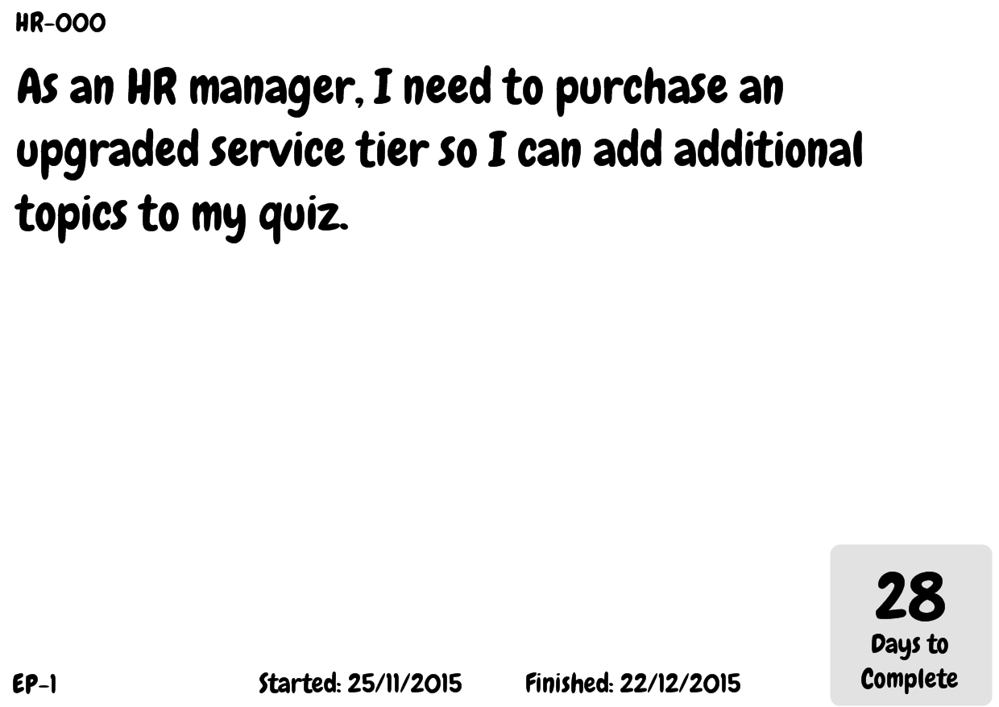
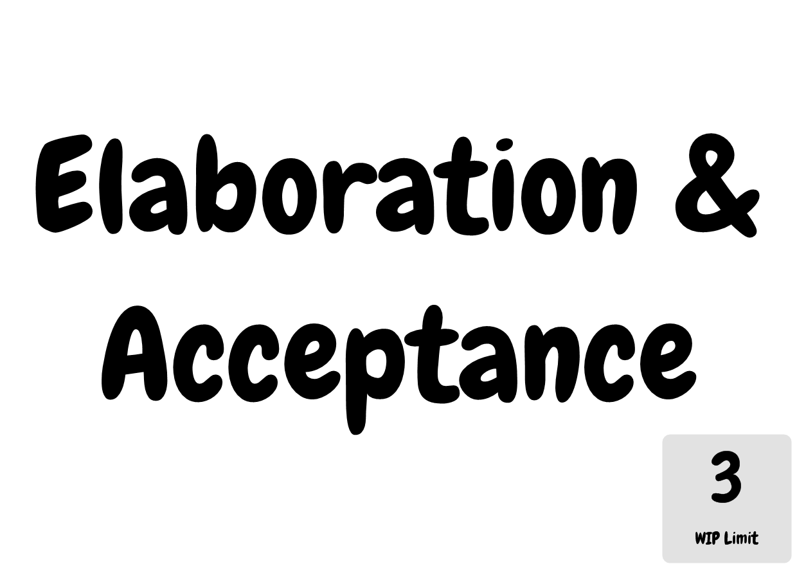

# Kanban Card Maker
[Card Maker](https://github.com/nhmkdev/cardmaker) project to generate Kanban board cards and labels. Generates cards and labels from .csv files.

Built with [v0.99.3.0](https://github.com/nhmkdev/cardmaker/releases/tag/v.0.99.3.0) of Card Maker

## Example Card

## Example Label

## Example PDF
All cards and labels can also be generated into a PDF. [Here is an example](examples/board.pdf) (skip past first blank page)
